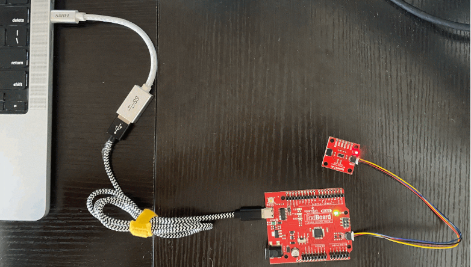
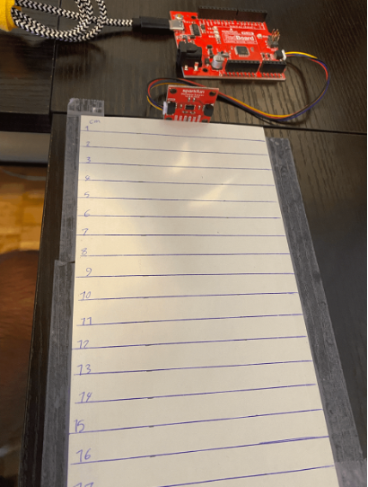

# Introduction

For one of my projects, I required an affordable range finder sensor. After some research, I opted for the SparkFun Distance Sensor VL53L4CD, which is a reasonably priced and relatively accurate sensor. In this document, I am sharing all the tests I conducted to assess the performance of this sensor.
The products I used are:

 - [SparkFun Distance Sensor VL53L4CD](https://www.sparkfun.com/products/18993) 

- [SparkFun RedBoard Plus](https://www.sparkfun.com/products/18158) (similar to the Arduino Uno)

- [Wall Adapter Power Supply - 9VDC, 650mA](https://www.sparkfun.com/products/15314) (if you want to use an adaptor; otherwise, USB-C is provided on board)

Following tests are conducted in this document: 
1. Sensor offset calibration
2. Accuracy measurement
3. Number of samples
4. Min and max effective range
5. Effect of the color on measurements
6. Effect of material on measurement

